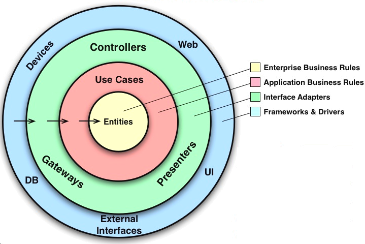

**Neutrino**

[<< Back ](req/index.md)

## Architecture
- We are using `Clean Architecture` principles to build the API.
- Also we are trying to adhere to `SOLID` principles when coding.
    - S - Single responsibility principle
    - O - Open-closed principle
    - L - Liskov substitution principle
    - I - Interface segregation principle
    - D - Dependency Inversion Principle
- We are incorporating `unit testing` as much as possible.
- Finally we use `RAML` to generate detailed and clear API documentation.

### Clean Architecture

The following image shows the basic outline of clean architecture.

